<!-- ═══════════════════════════════════════════════════════════════ -->
<!--                        REMASHP PROFILE                         -->
<!-- ═══════════════════════════════════════════════════════════════ -->

  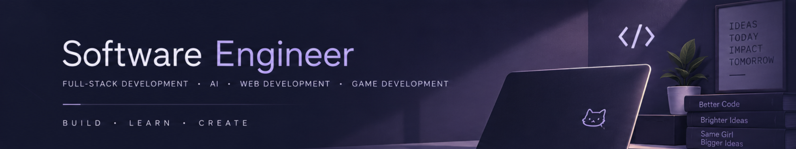

 

<!-- ═══════════════════════════════════════════════════════════════ -->
<!--                    ABOUT + TECH STACK                         -->
<!-- ═══════════════════════════════════════════════════════════════ -->

<table width="100%">
<tr>

<!-- ABOUT ME -->
<td width="50%" valign="top">

  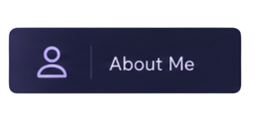

### Hi, I'm Remas! 💜

💻 **Software Engineer · Full Stack Developer**  
🤖 **AI Enthusiast · 🎮 Game Developer**

I build web applications, AI-powered systems,
and games, turning ideas into real products.

I'm especially interested in building technology that is:

✨ Useful  
🎮 Fun  
🤖 Intelligent  
🌱 Meaningful

</td>

<!-- TECH STACK -->
<td width="50%" valign="top">

  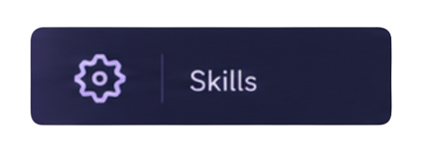

### 💻 Languages

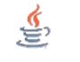

### ⚡ Frameworks & Tools

</td>

</tr>
</table>

 

---

<!-- ═══════════════════════════════════════════════════════════════ -->
<!--                     FEATURED PROJECTS                          -->
<!-- ═══════════════════════════════════════════════════════════════ -->

  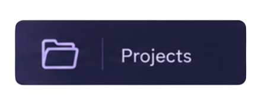

<table width="100%">
<tr>

<td width="33%" valign="top">

  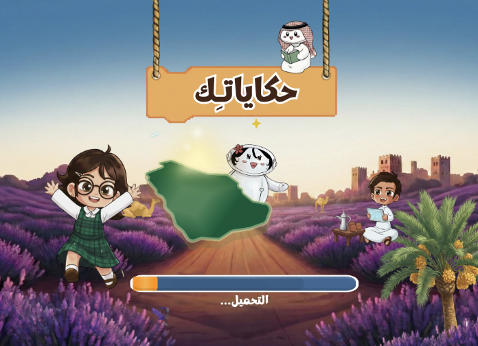

### 🎮 HakayTech

A story-based educational game developed with **Unity** to teach
programming fundamentals through interactive Arabic stories inspired
by Saudi culture.

**Tech:**  
`Unity` `C#` `Game Development`

</td>

<td width="33%" valign="top">

  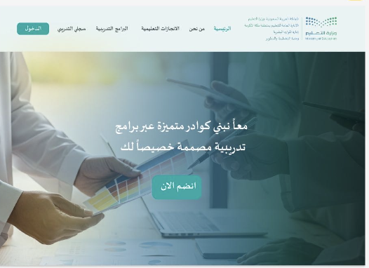

### 💻 Training Management Platform

A complete web platform developed during my cooperative training to
automate training operations, participant management, and workflows.

**Tech:**  
`JavaScript` `PHP` `SQL` `Web`

</td>

<td width="33%" valign="top">

  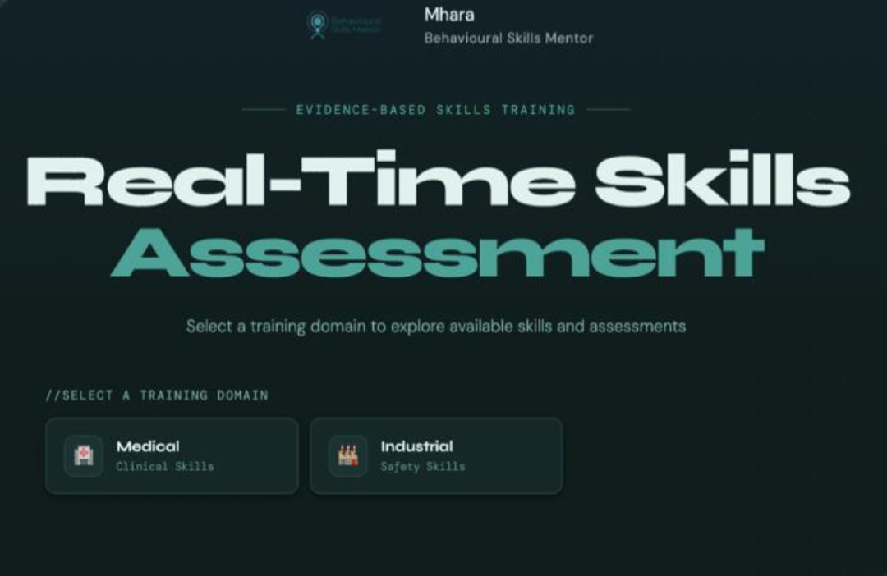

### 🤖 Maharah

An AI-powered behavioral skills assessment platform combining
computer vision, pose estimation, and standardized evaluation
criteria to provide real-time feedback.

**Tech:**  
`Python` `AI` `Computer Vision`

</td>

</tr>
</table>

 

---
<!-- ═══════════════════════════════════════════════════════════════ -->
<!--                         LITTLE DETAILS                         -->
<!-- ═══════════════════════════════════════════════════════════════ -->

   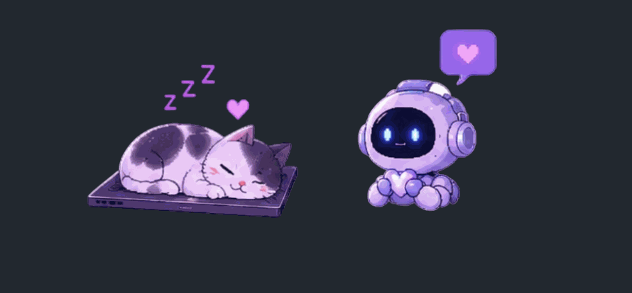

  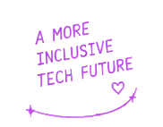

---

<!-- ═══════════════════════════════════════════════════════════════ -->
<!--                         LET'S CONNECT                          -->
<!-- ═══════════════════════════════════════════════════════════════ -->

  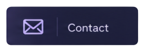

  
  &nbsp;&nbsp;&nbsp;&nbsp;
  <a href="mailto:remasabdulsttar@gmail.com">
    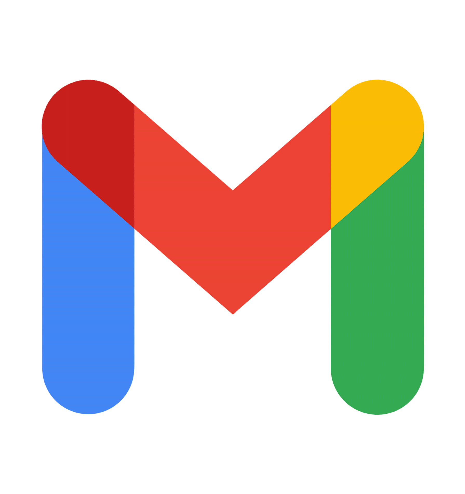
  </a>
  &nbsp;&nbsp;&nbsp;&nbsp;
  <a href="https://www.behance.net/remasabokhalily">
    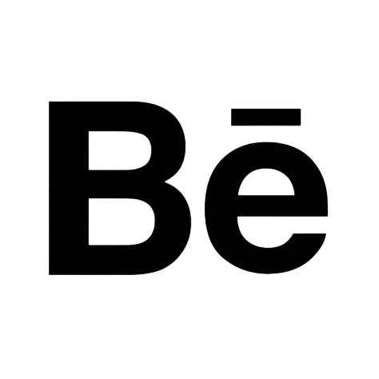
  </a>

  💜 <b>Thanks for stopping by!</b>
   
  Let's build something amazing together.

---

  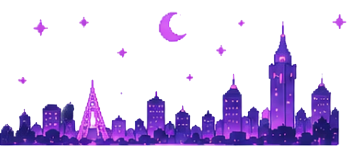

✨ 🎮 🤖 💻 ✨

 

<b>Building ideas. Creating products. Having fun along the way.</b>

