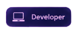
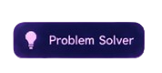
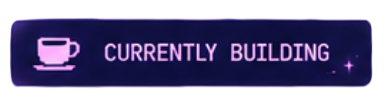
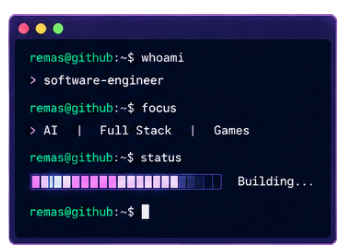
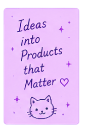
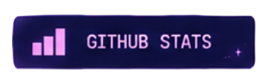
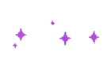
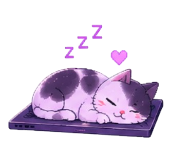
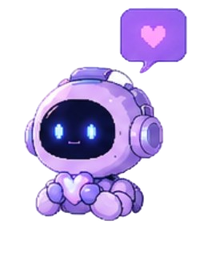

<!-- ═══════════════════════════════════════════════════════════════ -->
<!--                        REMASHP PROFILE                         -->
<!-- ═══════════════════════════════════════════════════════════════ -->

  

 

<!-- ═══════════════════════════════════════════════════════════════ -->
<!--                          ABOUT ME                              -->
<!-- ═══════════════════════════════════════════════════════════════ -->

  

### Hi, I'm Remas! 💜

💻 **Software Engineer · Full Stack Developer**  
🤖 **AI Enthusiast · 🎮 Game Developer**

I build web applications, AI-powered systems, and games,
turning ideas into real products.

I'm especially interested in:

✨ Useful technology  
🎮 Fun experiences  
🤖 Intelligent systems  
🌱 Meaningful products

  
  
  
  
  

<!-- ═══════════════════════════════════════════════════════════════ -->
<!--                     FEATURED PROJECTS                          -->
<!-- ═══════════════════════════════════════════════════════════════ -->

  

<table>
<tr>

<td width="33%" valign="top">

  

### 🎮 HakayTech

A story-based educational game developed with **Unity** to teach
programming fundamentals to children through interactive Arabic stories
inspired by Saudi culture.

**Tech:**  
`Unity` `C#` `Game Development` `Education`

</td>

<td width="33%" valign="top">

  

### 💻 Training Management Platform

A complete web platform developed during my cooperative training to
automate training operations, participant management, and
administrative workflows.

**Tech:**  
`JavaScript` `PHP` `SQL` `Web`

</td>

<td width="33%" valign="top">

  

### 🤖 Maharah

An AI-powered behavioral skills assessment platform combining
computer vision, pose estimation, and standardized evaluation criteria
to provide real-time feedback for practical training.

**Tech:**  
`Python` `AI` `Computer Vision`

</td>

</tr>
</table>

---

<!-- ═══════════════════════════════════════════════════════════════ -->
<!--                          TECH STACK                            -->
<!-- ═══════════════════════════════════════════════════════════════ -->

  

### 💻 Languages

### ⚡ Frameworks & Tools

<!--<<-->

<!--><-->

---

<!-- ═══════════════════════════════════════════════════════════════ -->
<!--                       CURRENTLY BUILDING                       -->
<!-- ═══════════════════════════════════════════════════════════════ -->

  

<table>
<tr>

<td width="60%" valign="top">

  

</td>

<td width="40%" valign="top">

### 🎯 Currently...

- 🤖 Building **Maharah (AI)**
- ⚛️ Learning **React**
- 🎮 Exploring **Game Development**
- 🌐 Improving **Full Stack Development**
- 🧠 Exploring **AI & Computer Vision**
- ✨ Turning ideas into products

</td>

</tr>
</table>

---

<!-- ═══════════════════════════════════════════════════════════════ -->
<!--                         MY FOCUS                               -->
<!-- ═══════════════════════════════════════════════════════════════ -->

  

💻 <b>Full Stack</b>
&nbsp;&nbsp; • &nbsp;&nbsp;
🤖 <b>Artificial Intelligence</b>
&nbsp;&nbsp; • &nbsp;&nbsp;
🎮 <b>Game Development</b>
&nbsp;&nbsp; • &nbsp;&nbsp;
✨ <b>Creative Technology</b>

---

<!-- ═══════════════════════════════════════════════════════════════ -->
<!--                         GITHUB STATS                           -->
<!-- ═══════════════════════════════════════════════════════════════ -->

  

<table>
<tr>

<td width="50%" align="center">

### 📊 GitHub

**Public Repositories**

# 32

**Followers**

# 8

**Following**

# 5

</td>

<td width="50%" align="center">

### ✨ Contributions

  

> Consistent progress leads to big results. 💜

</td>

</tr>
</table>

---

<!-- ═══════════════════════════════════════════════════════════════ -->
<!--                         LITTLE DETAILS                         -->
<!-- ═══════════════════════════════════════════════════════════════ -->

  

---

<!-- ═══════════════════════════════════════════════════════════════ -->
<!--                         LET'S CONNECT                          -->
<!-- ═══════════════════════════════════════════════════════════════ -->

  

&nbsp;&nbsp;&nbsp;

&nbsp;&nbsp;&nbsp;

💜 <b>Thanks for stopping by!</b>  
 
Let's build something amazing together.

---

  

  

✨ 🎮 🤖 💻 ✨

 

<b>Building ideas. Creating products. Having fun along the way.</b>

